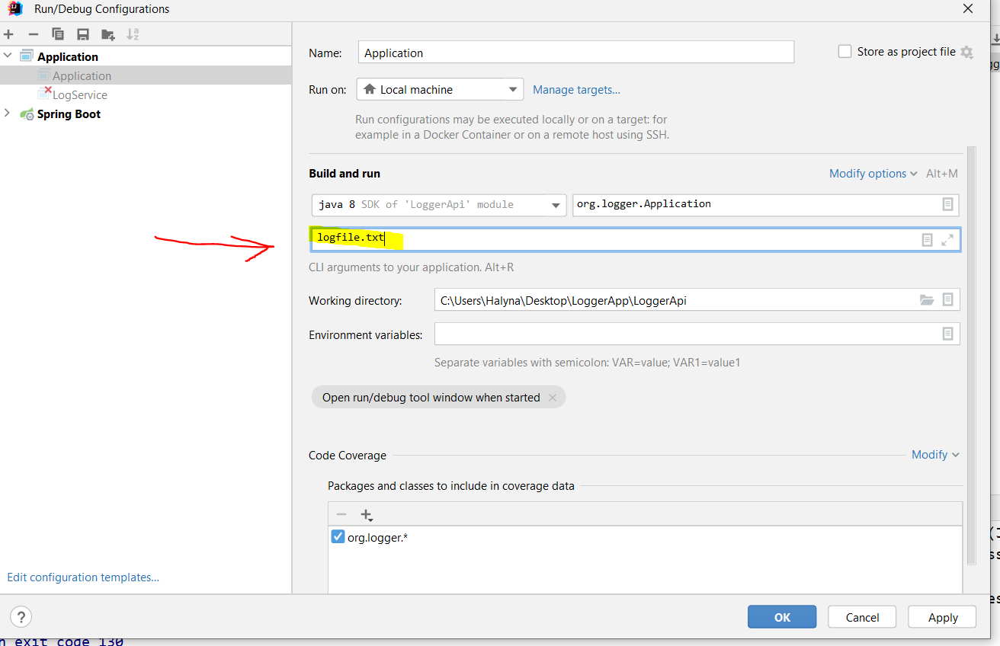
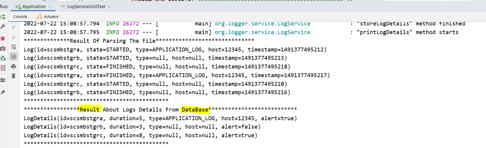

LoggerApi
To run the application by commandline:
1. Prerequisites: maven version 3.6.3 and above, jdk11
2. Installing: open a commandline in "logger" folder that contains project pom.xml file and use following commands:
- mvn clean  
- mvn compile
- mvn package 
3. After previous paragraph we will receive a jar file in target folder:
- target/LoggerApi-1.0-SNAPSHOT.jar
4. To run LoggerApi-1.0-SNAPSHOT.jar, enter in commandline:
5. java -jar target/LoggerApi-1.0-SNAPSHOT.jar

To run the application by IDE:
1. There is "logfile.txt" in the "resources" folder -> src/main/resources/logfile.txt
2. You can enter a file name (filePath) here: 
In case you don't enter a file name (filePath), it will already be predefined
3. Run the Application.java (src/main/java/org/logger/Application.java);
4. The result will be: 
5. Provided unit tests for LogService (src/test/java/org/logger/LogServiceUnitTest.java) and test for context of spring boot (src/test/java/org/logger/SpringBootContextTest.java).
6. After launch of the app you will find myApp.log in the root of the project.
7. The application uses HSQLDB, all setting are located in application.properties (src/main/resources/application.properties).

                               SUMMARY OF TASK
Our custom-build server logs different events to a file named logfile.txt. Every event has 2 entries in the file
- one entry when the event was started and another when the event was finished. The entries in the file
  have no specific order (a finish event could occur before a start event for a given id)
  Every line in the file is a JSON object containing the following event data:
  - id - the unique event identifier
  - state - whether the event was started or finished (can have values "STARTED" or "FINISHED"
  - timestamp - the timestamp of the event in milliseconds
  Application Server logs also have the following additional attributes:
  - type - type of log
  - host - hostname

{"id":"scsmbstgra", "state":"STARTED", "type":"APPLICATI ON_LOG", "host":"12345",
"timestamp":1491377495212}
{"id":"scsmbstgrb", "state":"STARTED", "timestamp":1491377495213}
{"id":"scsmbstgrc", "state":"FINISHED", "timestamp":1491377495218}
{"id":"scsmbstgra", "state":"FINISHED", "type":"APPLICATION_LOG", "host":"12345",
"timestamp":1491377495217}
{"id":"scsmbstgrc", "state":"STARTED", "timestamp":1491377495210}
{"id":"scsmbstgrb", "state":"FINISHED", "timestamp":1491377495216}
...

The program should:
- Take the path to logfile.txt as an input argument
- Parse the contents of logfile.txt
- Flag any long events that take longer than 4ms
- Write the found event details to file-based HSQLDB (http://hsqldb.org/) in the working folder
- The application should create a new table if necessary and store the following values:
- Event id
- Event duration
- Type and Host if applicable
- Alert (true if the event took longer than 4ms, otherwise false)
